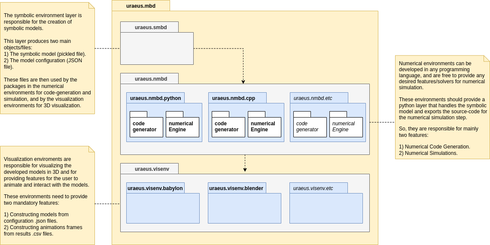
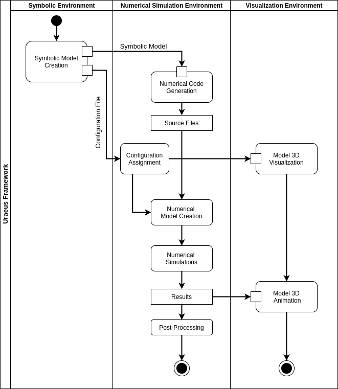

# URAEUS MBD

***An open-source framework for the modeling, simulation and visualization of constrained multi-body systems.***

---

### Multi-Body Systems

In modern literature, multi-body systems refer to modern mechanical systems that are often very complex and consist of many components interconnected by joints and force elements such as springs, dampers, and actuators. Examples of multi-body systems are machines, mechanisms, robotics, vehicles, space structures, and bio-mechanical systems. The dynamics of such systems are often governed by complex relationships resulting from the relative motion and joint forces between the components of the system. [1]

Therefore, a multi-body system is hereby defined as *a finite number of material bodies connected in an arbitrary fashion by mechanical joints that limit the relative motion between pairs of bodies*. 

Practitioners of multi-body dynamics study the generation and solution of the equations governing the motion of such systems [2].

---

### Audience and Fields of Application

Initially, the main targeted audience was the **Formula Student** community. The motive was to *encourage a deeper understanding of the modeling processes and the underlying theories used in other commercial software packages*, which is a way of giving back to the community, and supporting the concept of *"knowledge share"* adopted there by exposing it to the open-source community as well.

Currently, the tool aims to serve a wider domain of users with different usage goals and different backgrounds, such as students, academic researchers and industry professionals.

Fields of application include any domain that deals with the study of interconnected bodies, such as:

- Ground Vehicles' Systems.
- Construction Equipment.
- Industrial Mechanisms.
- Robotics.
- Biomechanics.
- .. etc.

----

<<<<<<< HEAD


<video width="320" height="240" controls>
  <source src="_readme_materials/iso_dlc_fsae.mp4" type="video/mp4">
</video>
=======

>>>>>>> 097c1aa5fba509600af84dd4947e4c0a1d06dc3b

----

## Background and Approach

### The Problem

#### What is the problem to be solved?

One of the primary interests in multi-body dynamics is to analyze the behavior of a given multi-body system under the effect of some inputs. In analogy with control systems; a multi-body system can be thought as a **_system_** subjected to some **_inputs_** producing some **_outputs_**. These three parts of the problem are dependent on the analyst end goal of the analysis and simulation. 

#### How is the system physics abstracted mathematically?

An unconstrained body in space is normally defined using 6 generalized coordinates defining its location and orientation in space. For example, a system of 10 bodies requires 60 generalized coordinates to be fully defined, which in turn requires 60 *independent equations* to be solved for these  _unknown_ generalized coordinates.

The way we achieve a solution for the system is dependent on the type of study we are performing. Mainly we have **four types** of analysis that are of interest for a given multi-body system. These are:

- **Kinematic Analysis**</br>
  *"How does the whole system move if we moved this particular body ?"*
- **Inverse Dynamic Analysis**</br>
  *"What are the forces needed to achieve this motion we just did ?"*
- **Equilibrium Analysis**</br>
  *"How does the system look if we did nothing ?"*
- **Dynamic Analysis**</br>
  *"Now we gave it a force, how does it behave ?"*

Each analysis type -or question- can be modeled by a set of algebraic and/or differential equations that can be solved for the system generalized states (positions, velocities and accelerations). A more detailed discussion of each analysis type will be provided in another documentation.

---

### The Approach

The philosophy of the framework is to *isolate the model creation process form the actual numerical and computational representation of the system*, that will be used in the numerical simulation process. This is done through the concepts of **symbolic computing** and **code-generation** as well be shown below.

The tool decomposes the problem into three main steps:

**1- Symbolic Model/Topology Creation.**

The System Topology is a description of the connectivity relationships between the bodies in a given multi-body system. These relationships represent the system constraints that control the relative motion between the system bodies and produce the desired kinematic behavior.

The tool abstracts the topology of the system as a multi-directed graph, where each node represents a body and each edge represents a connection between the end nodes, where this connection may represents a joint, actuator or a force element. The tool does not take any numerical inputs at that step, it only focuses on the validity of the topological design of the system, and not how it is configured in space.

**2- Numerical Code Generation.**

The process of performing actual simulations on the created model requires the generation of a valid numerical and computational representation of the model. This is done by taking in the symbolic model and generate valid code files written in the desired programming language with the desired programming paradigm and structure. The tool provides two numerical environments, one in python and another one in C++ (under development).

**3- Numerical Simulation.**

The final main step is to perform the desired simulations on the generated model. This is where we start giving our model the needed numerical inputs that defines the system configuration in space -bodies' and joints' locations and orientations-, as well as the needed actuation functions for the prescribed motions and forces -if exists-.
After the simulation step, we can do any sort of post-processing on the results. 

The tool also provide visualization libraries that can be used to visualize and animate the given model.

---

#### Framework Structure

The framework is structured as a "Layered Application", containing three main layers of sub-packages. Each layer focuses on a specific aspect of the problem, and can be developed independently, with minimum dependency on the other packages.

These framework layers are as follows:

1. **Symbolic Environment Layer**
2. **Numerical Simulation Environments Layer**
3. **3D Visualization Environments Layer**

The high-level structure of the framework is represented below as a **Model Diagram**, that illustrates these layers and their corresponding sub-packages.




---


#### Symbolic Environment Layer

Using the [**uraeus.smbd**](https://github.com/khaledghobashy/uraeus-smbd) python package, the topology of a given multi-body system is represented as a multi-directed graph, where each node represents a body and each edge represents a connection between the end nodes, where this connection may represents a joint, actuator or a force element. More details can be found at the [**uraeus.smbd**](https://github.com/khaledghobashy/uraeus-smbd) github repository.

---

#### Numerical Simulation Environments Layer

The process of performing actual simulations on the created model requires the generation of a valid numerical and computational code of the model. This is done by taking in the symbolic model and create a valid code base written in the desired programming language with the desired programming paradigm and structure.

Each numerical environment is responsible for the translation of the developed symbolic models into valid numerical code, and for the features it aims to provide for the users.

The development of such environments in different languages requires a good grasp of several aspects, such as :

- Good knowledge of the **uraeus.smbd** symbolic models' interfaces and structure.
- Good knowledge of the target language.
- Appropriate environment architecture/structure that serves the intended usage requirements.
- Good knowledge of the available linear algebra and math libraries for that language.
- Design for minimal dependencies on 3rd parties libraries.
- Simple API for usage and simple build process for compiled languages.

_**Note**: The development of such environments will be discussed in a separate documentation for those interested in developing their own._

---

#### Visualization Environments Layer

*t.b.c*

---

#### Conclusion

Several benefits of the adopted approach can be stated here, but the major theme here is the flexibility and modularity, in both software usage and software development. These can be summarized as follows:

- The distinction between the topology design phase and the configuration assignment phase, which gives proper focus for each at its' own.
- Natural adoption of the template-based modeling theme that emerges from the use of network-graphs to represent the system, which allows convenient assemblage of several graphs to form a new system. 
- Uncoupled simulation environment, where the symbolic equations generated form the designed topology is free to be written in any programming language with any desired numerical libraries.

---

### Current Features 

#### Symbolic Model Creation

The [**uraeus.smbd**](https://github.com/khaledghobashy/uraeus-smbd) is a python package developed for the symbolic creation and analysis of constrained multi-body systems. Mainly, it provides the user with the ability to:

- Create symbolic template-based and stand-alone multi-body systems using minimal API via python scripting..
- Create complex multi-body assemblies using template-based models.
- Visualize the systems' connectivity/topology as convenient network graphs.
- View the systems' symbolic equations in a natural mathematical format using Latex printing.


#### Code-Generation and Numerical Simulation

**Python Numerical Environment**

[**uraeus.nmbd.python**](https://github.com/khaledghobashy/uraeus-nmbd-python) is a numerical simulation environment developed in python, that generates numerical object-oriented code from symbolic models developed using **[uraeus.smbd](https://github.com/khaledghobashy/uraeus-smbd)**, and provides various numerical solvers to solve for the dynamics and kinematics of multi-body systems.

**C++ Numerical Environment**

*under development ...*


#### 3D Visualization

**Babylon.JS**

[**uraeus.visenv.babylon**](https://github.com/khaledghobashy/uraeus_visenv_babylon) is a browser-based, WebGL visualization environment, that makes use of the **[babylon.js](https://www.babylonjs.com/)** javascript library to easily visualize and animate the models developed in the **uraeus.mbd** framework.

**Blender**

*under development ...*

---

## Example

The figure below shows a high-level activity diagram of a typical usage flow of the framework, where we have three swim-lanes representing the main three activity layers of the framework.





We start at the symbolic environment lane, where we create our symbolic model, which is represented by the "Symbolic Model Creation" activity. This activity outputs two main objects.

1. **Symbolic Model**
   This is the symbolic model instance that contains the topological data of the multi-body system. This instance can be used directly to generate the numerical code through the code-generators provided, or can be saved as a binary `.stpl` file that can be used later.
2. **Configuration File**
   This is a `.json` file that contains the numerical inputs needed to be provided by the user at the "Configuration Assignment" activity. This file is used to define how the system in configured in 3D space, which is used by the numerical simulation engine for the numerical simulation, and used by the visualization engines as well to construct a 3D visualization of the model.

The "Symbolic Mode"l is then passed to the "Numerical Code Generation" activity, which creates the "Source Files" needed for the "Numerical Model Creation" activity along with the numerical configuration from the "Configuration Assignment" activity.
This numerical model is then used by "Numerical Simulations" activity to run the desired simulations. For dynamic and kinematic simulations, the results can be stored as `.csv` files that can be used by the visualization engines to animate the constructed 3D model.

---

### Simple Pendulum Example

Now, we will use the **uraeus.mbd** framework to model, simulate and animate a model of a simple pendulum, so follow along.

### Symbolic Environment 

#### Standalone Model

The **uraeus.smbd** python package provides two main types of symbolic models to be constructed, **standalone models**, and **template-based models**.

Standalone models stands for symbolic models that are fully described in one topology graph, where all the bodies and connections are already defined in the model graph, and therefore, the model is fully independent and does not need any other topological information.

On the other hand, template-based models are not fully described in one topology, as they need to be assembled with other templates to form a complete assembled topology. For example, this is the case for creating a full vehicle assembly, where we model the vehicle subsystems as templates, then we assemble them together to form the desired vehicle assembly. The creation of template-based models' database can be found in **[uraeus.fsae](https://github.com/khaledghobashy/uraeus_fsae)**, which is an under-development multi-body systems database for formula-style vehicles implemented in the **uraeus** framework.

For our case, the model will be created as a standalone model and project.

#### Project Structure

An important step to do before the actual modeling step, is how can we structure and store our files and scripts to keep things organized some how. This is not a mandatory step but is highly recommended to keep things neat.

A recommended project structure for standalone projects is as follows:

```bash
standalone_project/
├── numenv
├── simenv
│   ├── configs
│   ├── python
│   │   └── simulation.py
│   └── results
└── symenv
    ├── data
    └── sym_model.py

```

On the root level, we have three main directories:

1. **numenv**
   Short for *"**num**erical **env**ironments"*. A directory to store the numerical code files of the model that are generated by the uraeus code-generators.
2. **simenv**
   Short for *"**sim**ulation **env**ironments"*. A directory to store the numerical simulation files, the numerical configurations .json files and the results of the simulations. The directory contains two main sub-directories, the `results` and the `config` directories, where additional directories are added for the desired simulation environments used.
3. **symenv**
   Short for *"**sym**bolic **env**ironment"*. A directory to store the symbolic model files. This directory has the `sym_model.py` script that contains the model script, and a `data` directory that is used to store the output files from the  "*Symbolic Model Creation*" activity.

**Note**: 
*It should be noted that this project structure may not be the optimal way to structure your project, and you are encouraged to restructure this as you see fit.*


#### Building the Symbolic Topology

We start by importing the `standalone_topology` class from the systems module to create our symbolic model instance, and setting-up some needed directory variables.

```python
# standard library imports
import os
	
# uraeus imports
from uraeus.smbd.systems import standalone_topology, configuration
	
# getting directory of current file and specifying the directory
# where data will be saved
dir_name = os.path.dirname(__file__)
data_dir = os.path.join(dir_name, 'data')
```

We then start constructing our system by adding the bodies, joints, actuators and/or forces. For our system, we have one body "**body**", the pendulum, that is connected to the "**ground**" via a revolute joint "**a**".

```python
# ============================================================= #
#                       Symbolic Topology
# ============================================================= #
	
# Creating the symbolic topology as an instance of the
# standalone_topology class
project_name = 'pendulum'
sym_model = standalone_topology(project_name)
	
# Adding Bodies
# =============
sym_model.add_body('body')
	
# Adding Joints
# =============
sym_model.add_joint.revolute('a', 'ground', 'rbs_body')
```

And that's it; we have just created a symbolic topology that represents our simple pendulum mechanism. The topology graph of the system can be visualized by the method `sym_model.topology.draw_constraints_topology()`. 
Also we can check the number of constraint equations, generalized coordinates and the estimated degrees of freedom of the system. 
To finalize this step, we call the `assemble()` method to construct the governing equations symbolically then save the model via the `save()` method which exports the file `pendulum.stpl`  into the `symenv\data\` directory.

```python
# Assembling and Saving the model
sym_model.assemble()
sym_model.save(data_dir)
```

We can check the system equations by accessing the appropriate topology attributes.

```python
# Position level constraint equations.
sym_model.topology.pos_equations

# System Jacobian of the position level constraint equations.
sym_model.topology.jac_equations
```

###  

#### Building the Symbolic Configuration.

The next step is to create a symbolic configuration of our symbolic model, but what is this symbolic configuration?

You may have noticed that we did not care explicitly about how our system is configured in space, we did not care about how our bodies or joints are located or oriented or how we can define these configuration parameters, all we cared about is only the topological connectivity. 
These configuration parameters already got generated automatically based on the used components. For example, the creation of a symbolic body "**body**" generates automatically the following symbolic parameters needed for the numerical simulation later on:

- `m_rbs_body`: body mass.
- `Jbar_rbs_body`: body local inertia tensor.
- `R_rbs_body`: body reference point location vector.
- `Rd_rbs_body`: body translational velocity vector.
- `P_rbs_body`: body orientation quaternion.
- `Pd_rbs_body`: body orientation quaternion 1st time derivative.

where the **rbs_** initial is short for *"**r**igid **b**ody **s**ingle"*. If the body is mirrored, the system will create two bodies with the initials **rbr_** and **rbl_** for **r**ight and **l**eft respectively.

The same happens for edges' components -joints, actuators and forces- where each component is responsible for creating its own configuration symbolic parameters.

These parameters are extracted from the symbolic topology to form the primary configuration layer that represents the needed user inputs for any given simulation. The benefit of the symbolic configuration is that we can construct our own layer of inputs that we desire to use in the numerical simulation and define the relations between these inputs and the primary parameters extracted from the topology components. This is best shown by example.

We start by creating our configuration instance, passing it a name and our symbolic model.

```python
# Symbolic configuration name.
config_name = '%s_cfg'%project_name

# Symbolic configuration instance.
sym_config = configuration(config_name, sym_model)
```

Now we can check the primary configuration parameters extracted the from the symbolic topology by checking the `sym_config.config.input_nodes` variable, which returns a list of strings containing the inputs' parameters names.

Now, we create our desired user inputs.

```python
# Adding the desired set of UserInputs
# ====================================
sym_config.add_point.UserInput('p1')
sym_config.add_point.UserInput('p2')
	
sym_config.add_vector.UserInput('v')
```

After that, we set the relations between the primary configuration parameters and our custom configuration inputs.

```python
# Defining Relations between original topology inputs
# and our desired UserInputs.
# ===================================================

# Revolute Joint (a) location and orientation
sym_config.add_relation.Equal_to('pt1_jcs_a', ('hps_p1',))
sym_config.add_relation.Equal_to('ax1_jcs_a', ('vcs_v',))
```

An optional and recommended step is to create symbolic geometries and assign these geometries to topology bodies to automatically evaluate the bodies configuration parameters stated earlier. Also this will be used to create 3D visualizations later.

```python
# Creating Geometries
# ===================
sym_config.add_scalar.UserInput('radius')
	

sym_config.add_geometry.Sphere_Geometry('body', ('hps_p2', 's_radius'))

sym_config.assign_geometry_to_body('rbs_body', 'gms_body')
```

The last step is to export the configuration data into a JSON file that can be used then by other numerical and visualization environments. This exports a `pendulum_cfg.json` file into the `symenv/data/` directory.

```python
# Exporing the configuration as a JSON file
sym_config.export_JSON_file(data_dir)
```

A version of the code we discussed can be found [here](https://github.com/khaledghobashy/uraeus_mbd/blob/master/standalone_models/pendulum/symenv/sym_model.py) as well.


### Numerical Simulation Environment

Now, we transition to the second swim-lane, the Numerical Simulation stage, where we generate  the needed source-code for numerical simulations using the language of interest.

As mentioned previously, the tool provides two numerical environments, one in **python** and another one in **C++** (under development). Here we will use the **[uraeus.nmbd.python](https://github.com/khaledghobashy/uraeus-nmbd-python)** package for the numerical simulation of our model.

#### Code Generation

We first import the `standalone_project` class and call the `.create_dirs()` method to create the directories `python/src/` inside the `numenv/` directory located at the root of our project structure.
We then call the `.write_topology_code(sym_model)` and pass it our model to generate the required source-code. This method can also take in a `.stpl` file object that stores in the model data as a python pickled file.

This creates the numerical source-code as a `pendulum.py` file inside the `numenv/python/src` directory, which will be used later in the numerical simulation.

```python
# ============================================================= #
#                     Code Generation
# ============================================================= #

from uraeus.nmbd.python import standalone_project
project = standalone_project()
project.create_dirs()

project.write_topology_code(sym_model)
```


#### Numerical Simulation

Now we use the generated source-code to create a valid simulation instance. We first create a `.py` file at the `simenv/python/` directory, we may call it `simulation.py` for convenience. A template for the `simulation.py` file can be found **[here](https://github.com/khaledghobashy/uraeus_mbd/blob/master/_template_structure/standalone_project/simenv/python/simulation.py)**.

From the activity diagram above, we are now at the "Numerical Model Creation" activity, which requires two main objects, the generated source-code `numenv/python/src/pendulum.py`, and the numerical configuration `symenv/data/pendulum_cfg.json`.

In order to do so, we start with the needed imports.

```python
# standard library imports
import os

# 3rd party imports
import numpy as np
import pandas as pd
import matplotlib.pyplot as plt

# uraeus imports
from uraeus.nmbd.python import (import_source, multibody_system, 
                                simulation, configuration)
```

Then we setup some needed variables related to the project structure.

```python
# ============================================================= #
#                		    Helpers
# ============================================================= #

# getting to the root project directory from this file directory
dir_name = os.path.dirname(__file__)

# creating the various needed directories references
project_dir = os.path.abspath(os.path.join(dir_name, '../../'))
symdata_dir = os.path.join(project_dir, 'symenv/data/')
numdata_dir = os.path.join(project_dir, 'numenv/python/src/')
results_dir = os.path.join(project_dir, 'simenv/results/')
```


Now, we create the numerical model.

```python
# ============================================================= #
#                           Initializations
# ============================================================= #

model_name = 'pendulum'

# getting the configuration .json file
config_file = os.path.join(symdata_dir, 'pendulum_cfg.json')

# Creating a numerical configuration instance
num_config = configuration('base')
# constructing the numerical configuration instance from
# imported JSON file
num_config.construct_from_json(config_file)

# Getting the numrical topology module
model = import_source(numdata_dir, model_name)

# Creating the numerical model from the imported module
num_model  = multibody_system(model)
# Assigning this configuration instance to the numerical model
num_model.topology.config = num_config
```


Now, we assign numerical values to our configuration.

```python
# ============================================================= #
#              Numerical Configuration of the System
# ============================================================= #

num_config.hps_p1.flat[:] = 0, 0, 0
num_config.hps_p2.flat[:] = 0, 200, 0
num_config.vcs_v.flat[:] = 1, 0, 0

num_config.s_radius = 20

# Assembling the configuration and exporting a .json file that
# holds these numerical values
num_config.assemble()
num_config.export_json('simenv/configs')
```


Here, we create a simulation instance and pass it the numerical model `num_model` instance and the type of the simulation we are performing, `kds` for kinematically driven systems, and `dds` for dynamically driven systems.

We then setup our time grid for the simulation and call the `solve()` method to start the simulation. The simulation results can be saved as a `.csv` which stores the time history of the system position coordinates, and as a `.npz` that stores the position, velocities and accelerations of the system coordinates, as well as the lagrange multipliers representing the system reactions. 

```python
# ============================================================= #
#                   Creating the Simulation Instance
# ============================================================= #
sim = simulation('sim', num_model, 'dds')

# setting the simulation time grid
sim.set_time_array(20, 5e-3)

# Starting the simulation
sim.solve()

# Saving the results in the /results directory as csv and npz
sim.save_as_csv(results_dir, 'test_1')
sim.save_as_npz(results_dir, 'test_1')
```

After that, we can plot the results as below

```python
# ============================================================= #
#                   Plotting the Simulation Results
# ============================================================= #

sim.soln.pos_dataframe.plot(x='time', y=['rbs_body.z', 'rbs_body.y'], grid=True, figsize=(10,4))
sim.soln.vel_dataframe.plot(x='time', y='rbs_body.z', grid=True, figsize=(10,4))
sim.soln.acc_dataframe.plot(x='time', y='rbs_body.z', grid=True, figsize=(10,4))

plt.show()
```


---


---

## References

**[1]** : Shabana, A.A., *Computational Dynamics*, Wiley, New York, 2010.

**[2]** : McPhee, J.J. Nonlinear Dyn (1996) 9: 73. https://doi.org/10.1007/BF01833294


