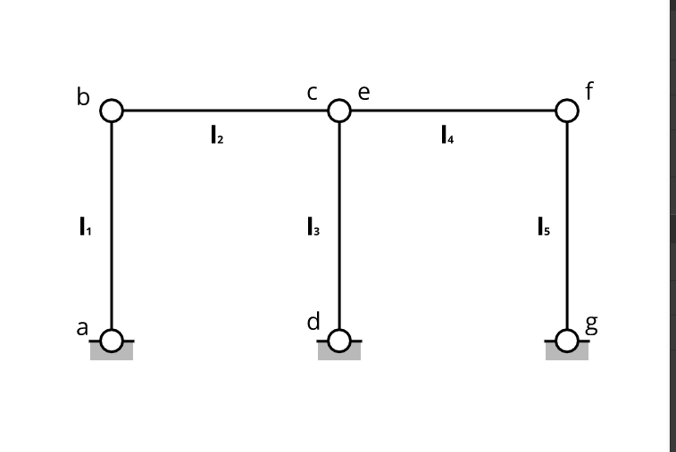

# DOUBLE FOURBAR

**STANDALONE TOPOLOGY**

------------------------------------------------

### **Summary**

The figure shows a double four-bar mechanism, which is simply an extended version of a simple four-bar. The model is used in benchmarks studies to study the singular configurations of mechanisms. When the  mechanism reaches the horizontal position, the number of degrees of freedom instantaneously increases  from 1 to 3. Therefore, this benchmark problem is proposed as an example of multibody system going through singular positions.

--------------------------------------

### **Topology Layout**
The mechanism consists of 5 Bodies + 1 Ground. Therefore, total system coordinates -including the ground- is $$n=n_b\times7 = 6\times7 = 42$$  where $n_b$ is the total number of bodies. [^1]

The list of bodies is given below:

- Crank ($l_1$).
- Crank ($l_3$).
- Crank ($l_5$).
- Coupler ($l_2$).
- Coupler ($l_4$).

The system connectivity is as follows:
- Cranks $l_1$, $l_3$ and $l_5$ are connected to the ground by revolute joints, resulting in constraint equations $3 \times n_{c,rev} = 3 \times 5 = 15$
- Each coupler is connected to the adjacent cranks by two spherical joints at each end, resulting in constraint equations $4 \times n_{c,sph} = 4 \times 3 = 12$
- System Degrees of Freedom is then given by $42 - ((1\times6) + 15 + 12 + 6) = 42 - 39 = 3$, where the extra 2 DOF arise from the unconstrained spin of each coupler due to the use of spherical joints at each end.

------------------------------------------------------
 

[^1]: The tool uses [euler-parameters](https://en.wikibooks.org/wiki/Multibody_Mechanics/Euler_Parameters) -which is a 4D unit quaternion- to represents bodies orientation in space. This makes the generalized coordinates used to fully define a body in space to be **7,** instead of **6**, it also adds an algebraic equation to the constraints that ensures the unity/normalization of the body quaternion. This is an important remark as the calculations of the degrees-of-freedom depends on it.

