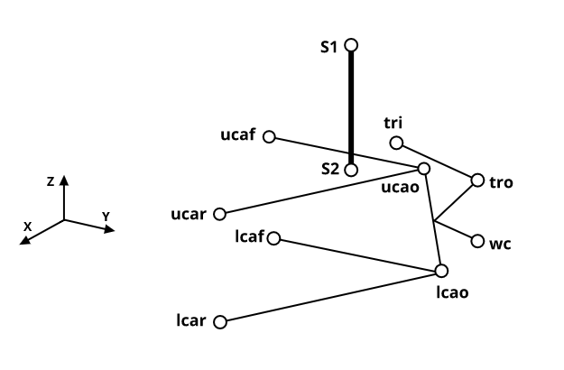

# DOUBLE WISHBONE DIRECT ACTING

**STANDALONE TOPOLOGY**

------------------------------------------------

### **Summary**

A **double wishbone** mechanism is a type of  independent suspension mechanism used for automotive. It controls the motion of the wheel assembly via two control arms that are connected to the chassis from one end and to the wheel-carrier on the other end, which resembles a **four-bar linkage**, with the chassis being the ground, and the wheel-carrier being the coupler. The wheel-carrier is connected also to the chassis via a tie-rod that constrains the steering of the wheel-assembly as well. 

This kinematic chain is augmented with a another simple chain that controls the vertical motion of the wheel-assembly, this simple chain can be a direct-acting coil-over that is connected to either one of the control arms and the chassis, or can be a rocker-push/pull rod mechanism that is connected to the coil-over.

*Figure 1 - Double Wishbone Layout*

--------------------------------------

### **Topology Layout**

The mechanism consists of 8 Bodies + 1 Ground. Therefore, total system coordinates -including the ground- is $n=n_b\times7 = 9\times7 = 63$, where $n_b$ is the total number of bodies. [^1]

The list of bodies is given below:

- Upper Control Arm **(UCA)**.
- Lower Control Arm **(LCA)**.
- Upright.
- Wheel Hub.
- Tie-Rod.
- CoilOver P1.
- CoilOver P2.
- Steering Rack.

The system connectivity is given in the table below.

| Joint Name      | Body i        | Body j      |  Joint Type   | $n_c$ |
| :-------------- | :------------ | :---------- | :-----------: | ----: |
| UCA Outer Joint | UCA           | Upright     |   Spherical   |     3 |
| LCA Outer Joint | LCA           | Upright     |   Spherical   |     3 |
| Tie-Rod Outer   | Tie-Rod       | Upright     |   Spherical   |     3 |
| UCA-Chassis     | UCA           | Chassis     |   Revolute    |     5 |
| LCA-Chassis     | LCA           | Chassis     |   Revolute    |     5 |
| Hub Bearing     | Wheel-Hub     | Upright     |   Revolute    |     5 |
| Tie-Rod Inner   | Tie-Rod       | Chassis     |   Universal   |     4 |
| CoilOver Top    | CoilOver P1   | Chassis     |   Universal   |     4 |
| CoilOver Bottom | CoilOver P2   | UCA         |   Universal   |     4 |
| CoilOver Cyl    | CoilOver P1   | CoilOver P2 |  Cylindrical  |     4 |
| Rack-Chassis    | Steering Rack | Chassis     | Translational |     5 |
| **Total**       |               |             |               |    45 |

 

Hence, the total number of constraints equations is:
$$ n_{c} = n_{c_j} + n_{c_p} + n_{c_g} = 45 + (9\times 1) + 6 = 60 $$

where:
* $n_{c_j}$ is the joints constraints.
* $n_{c_p}$ is the euler-parameters normalization constraints.
* $n_{c_g}$ is the ground constraints.

Therefore, the resulting **DOF** is:
$$ n - n_c = 63 - 60 = 3 $$

which can be interpreted in a convenient way that one DOF is the rotational motion of the wheel, one is the vertical motion and one for the rack travel.

------------------------------------------------------
 

[^1]: The tool uses [euler-parameters](https://en.wikibooks.org/wiki/Multibody_Mechanics/Euler_Parameters) -which is a 4D unit quaternion- to represents bodies orientation in space. This makes the generalized coordinates used to fully define a body in space to be **7,** instead of **6**, it also adds an algebraic equation to the constraints that ensures the unity/normalization of the body quaternion. This is an important remark as the calculations of the degrees-of-freedom depends on it.

